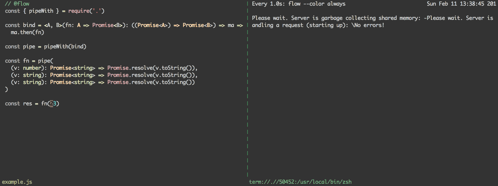

# pipe-with

[](https://travis-ci.org/justinvdm/pipe-with)

(type-aware) utility function for defining how a pipeline of functions should be composed

```js
const pipe = pipeWith(fn => ma => ma.then(fn))

const fn = pipe(
  v => Promise.resolve(v + 1),
  v => Promise.resolve(v * 2))

fn(23).then(console.log)  // 48
```

and with flow:



## install

```
$ npm i pipe-with
```

## important note for type definitions

When using this library with flow or typescript, there is a limit of 16 arguments for `pipe` functions.

## api

### `pipeWith(bindFn)`

Takes in a bind function and returns a corresponding pipe function. The pipe function composes the functions passed to it from left to right, but processes the result of each function call using the bind function. The bind function should have a type signature of `(a -> m b) -> (m a -> m b)`.

For example, if we wanted to compose promise-returning functions, `bindFn` could look like this:

```js
const bind = <A, B>(fn: A => Promise<B>): ((Promise<A>) => Promise<B>) =>
  ma => ma.then(fn)
```

### `pipe([...fns])`

Composes the given functions from left to right. For e.g. `pipe(fn1, fn2)(v)` would return the same result as `fn2(fn1(v))`.
